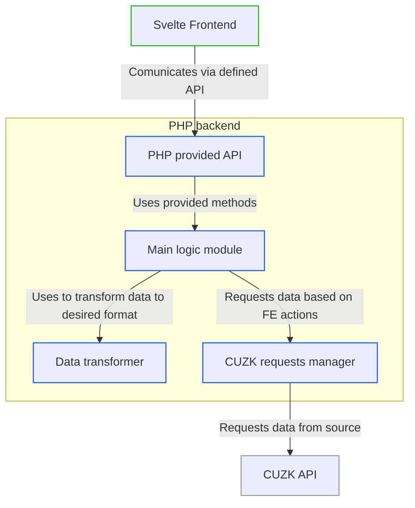

```mermaid

flowchart TD
    FRONTEND["Svelte Frontend"]

    subgraph BACKEND["PHP backend"]
        API["PHP provided API"]
        TRANSFORMER["Data transformer"]
        LOGIC["Main logic module"]
        REQUESTER["CUZK requests manager"]
    end

    CUZK["CUZK API"]

    FRONTEND -->|"Comunicates via defined API"| API
    
    API -->|"Uses provided methods"| LOGIC
    LOGIC -->|"Requests data based on FE actions"| REQUESTER
    LOGIC -->|"Uses to transform data to desired format"| TRANSFORMER

    REQUESTER -->|"Requests data from source"| CUZK

    classDef frontend stroke: #29b826, stroke-width: 1.5px
    classDef backend stroke: #2563EB, stroke-width: 1.5px
    classDef external stroke: #a1a1a1, stroke-width: 1.5px
    class FRONTEND frontend
    class API,TRANSFORMER,LOGIC,REQUESTER backend
    class CUZK external
```